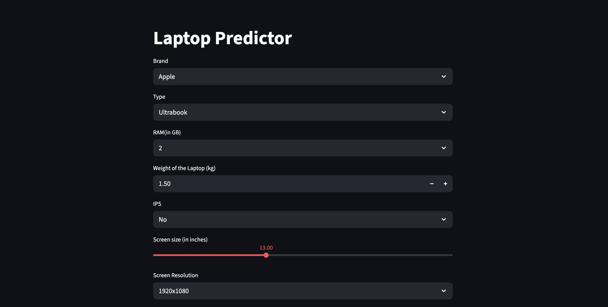
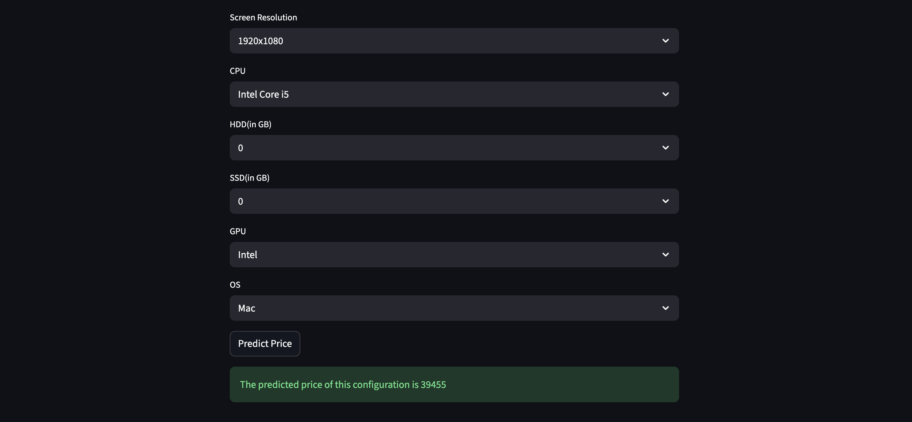

# 💻 Laptop Price Predictor

A machine learning-powered web application designed to **estimate the market price of a laptop** based on its hardware and physical specifications. This tool provides instant, data-driven price predictions, making it invaluable for both buyers and sellers to assess fair market value accurately.

---

## ✨ Key Features

* **Accurate Price Prediction:** Utilizes a trained machine learning model (e.g., Random Forest Regressor, Decision Tree) to predict the price based on various features.
* **Intuitive Web Interface:** A user-friendly front-end application (likely built with **Streamlit** or **Flask**) allows users to easily input specifications via dropdowns and sliders.
* **Comprehensive Parameter Input:** Accounts for a wide range of factors that significantly influence laptop pricing.

---

## ⚙️ Input Parameters

The model relies on the following specifications for prediction, capturing the full configuration of the device:

| Category | Parameter | Example Value |
| :--- | :--- | :--- |
| **Basic** | **Brand** | Apple, HP, Dell, etc. |
| **Type** | **Laptop Type** | Ultrabook, Gaming, Notebook, etc. |
| **Display** | **Screen Size (in inches)** | 13.0, 15.6, 17.3, etc. |
| **Display** | **Screen Resolution** | 1920x1080, 2560x1440, etc. |
| **Display** | **IPS Panel** | Yes/No |
| **Core Hardware**| **CPU** | Intel Core i5, AMD Ryzen 7, etc. |
| **Core Hardware**| **GPU** | NVIDIA GeForce, Intel Integrated, AMD Radeon, etc. |
| **Memory** | **RAM (in GB)** | 2, 4, 8, 16, 32 |
| **Storage** | **HDD (in GB)** | 0, 500, 1000, 2000 |
| **Storage** | **SSD (in GB)** | 0, 128, 256, 512, 1024 |
| **Other** | **OS** | Mac, Windows, Linux, No OS |
| **Other** | **Weight (kg)** | 1.00 - 3.50+ |

---

## 🛠️ Technology Stack

This project is built using a standard Python-based data science and web development stack:

* **Language:** Python
* **Data Processing:** Pandas, NumPy
* **Machine Learning:** Scikit-learn (for model training and saving the model file)
* **Web Framework:** Streamlit / Flask (Based on the interactive UI)
* **Environment Management:** `venv` or `conda`

---

## 🚀 Installation and Setup

Follow these steps to set up and run the project locally.

### Prerequisites

* Python 3.x
* Git

### Steps

1.  **Clone the Repository:**
    ```bash
    git clone [https://github.com/dipti-2211/Laptop-Predictor.git](https://github.com/dipti-2211/Laptop-Predictor.git)
    cd Laptop-Predictor
    ```

2.  **Create a Virtual Environment (Recommended):**
    ```bash
    # On macOS/Linux
    python3 -m venv venv
    source venv/bin/activate
    
    # On Windows
    python -m venv venv
    .\venv\Scripts\activate
    ```

3.  **Install Dependencies:**
    ```bash
    pip install -r requirements.txt
    ```
    *(**Note:** Ensure your model dependencies like `scikit-learn`, `pandas`, and the web framework (`streamlit` or `flask`) are listed in `requirements.txt`.)*

4.  **Run the Application:**
    *(Assuming the main application file is `app.py` and the framework is **Streamlit**)*
    ```bash
    streamlit run app.py
    ```

5.  Open your browser and navigate to the local URL provided in the console (e.g., `http://localhost:8501`).

---

## 📸 Demo Screenshots

These images demonstrate the process of inputting specifications and viewing the predicted price.

### 1. Basic Specifications Input




### 2. Hardware Input & Prediction Output



> **Prediction Result:** The predicted price for this configuration is **39455**. (The specific currency is dependent on the training dataset's base currency.)

---

## 🤝 Contributing

Contributions are welcome! If you have suggestions for improving the model accuracy, the user interface, or documentation, please feel free to open an issue or submit a pull request.

---

## ✍️ Author

GitHub - **[Dipti](https://github.com/dipti-2211)**

Portfolio - **[Dipti's Portfolio](https://dipti-singh-portfolio.vercel.app/)**

Linkdein - **[Linkdein](https://www.linkedin.com/in/dipti-singh-3b0274309/)**

---
